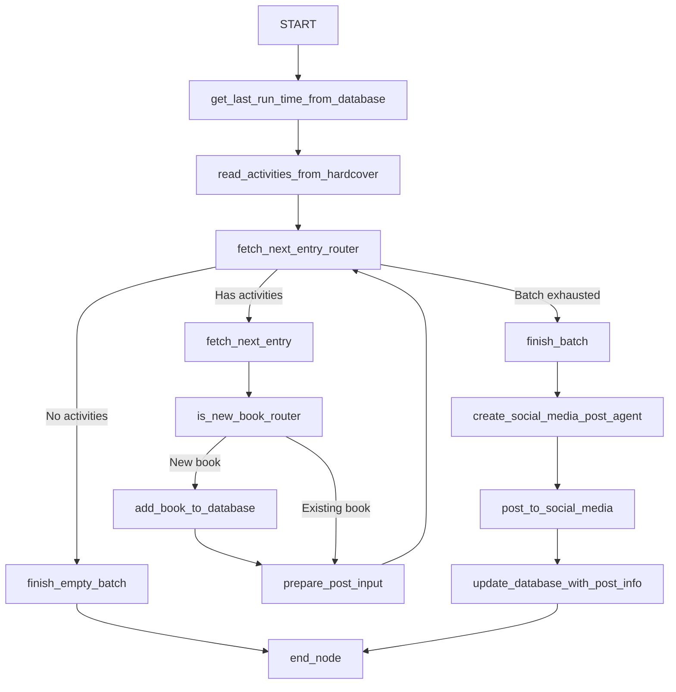

# Workflow

```mermaid
graph TD
    START --> get_last_run_time_from_database --> read_activities_from_hardcover
    read_activities_from_hardcover --> fetch_next_entry_router
    fetch_next_entry_router -- "No activities" --> finish_empty_batch --> end_node
    fetch_next_entry_router -- "Has activities" --> fetch_next_entry
    fetch_next_entry --> is_new_book_router
    is_new_book_router -- "New book" --> add_book_to_database --> prepare_post_input
    is_new_book_router -- "Existing book" --> prepare_post_input
    prepare_post_input --> fetch_next_entry_router
    fetch_next_entry_router -- "Batch exhausted" --> finish_batch
    finish_batch --> create_social_media_post_agent --> post_to_social_media
    post_to_social_media --> update_database_with_post_info --> end_node
```
